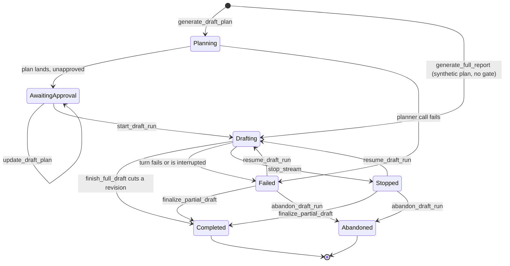

# Drafting runs

A **drafting run** is the writer's resumable unit of whole-report work. One
run covers a document from the plan a clinician approves, through the sections
an Opus conversation writes one call at a time, to the revision the finisher
cuts — and it survives every way that sequence can be interrupted, because the
run object is rewritten to S3 after every section that lands.

This is the successor document to `writer.md`'s whole-report section: that file
describes the two writing modes and the turn loop they share; this one
describes the durable machinery underneath the whole-report mode. Targeted
editing has no run.

Crates: `claria-report-store` owns the run and findings objects and their
optimistic-concurrency protocol; `claria-report-pipeline` owns the planner, the
run executor, the review fan-out, and the completion gate; `claria-bedrock`
owns the Converse wire shape, forced-tool calls, and cache placement.

---

## The objects

| Object | Key | What it is |
|---|---|---|
| Workspace | `report-authoring/{client}/sessions/{report_id}.json` | The accepted draft, the session, and `active_run_id` |
| Run | `report-authoring/{client}/runs/{report_id}/{run_id}.json` | One run's plan, per-section state, and staged content |
| Findings | `report-authoring/{client}/findings/{report_id}.json` | Every review finding for the report, with apply/undo history |

The workspace and the run are two objects on purpose, written in a fixed order:
**workspace first, run second**. The revision is the clinician's document and
the run is bookkeeping about it, so the one crash window the protocol leaves
open — a cut revision whose run never recorded its own finish — is healed on
the next load from evidence in the workspace, rather than failing a generation
that already landed.

`active_run_id` is the lock. While it is set, a run owns the session: hand
saves, template applies, reverts, queued-edit discards, and further writer
turns are all refused. A run cannot start over a pending proposal in the first
place, so the two never overlap. A failed run releases the lock immediately; a
completed run clears it as part of the cut.

---

## Run lifecycle



`Stopped` and `Failed` differ in one way that matters: a failed run releases
`active_run_id`, a stopped one keeps it. Stopping is a decision, so the session
stays pointed at the run the reader stopped, and the guards that refuse
competing edits keep the report still underneath the sections it already wrote.
`release_failed_run` and `park_stopped_run` are the two halves of that.

Every command that streams opens a `StopRegistration` against its `stream_id`,
so `stop_stream` reaches the run in flight; the stream loop drops the call
whole and the run is parked. Resuming it, finalizing what it landed, or
abandoning it are the three ways the pointer is released. `abandon_draft_run`
accepts a run in any status but `Completed` — a run that already cut a revision
is reverted, not discarded — and leaves the sections it landed on the object as
history.

Every section of the report gets a row on the run — kept and skipped ones
included — so `run.sections` is the complete section universe and the finisher
assembles from it rather than re-deciding which sections exist. Each row runs
its own small machine:

`Pending → Drafting → Drafted | Failed | Skipped | Kept`, plus `Flagged` for a
drafted section a review pass raised something against.

`Kept` is produced by the parallel coordinator and nothing else: it is what a
`keep` plan row means once the run reaches the point of carrying it out — the
base revision's content stands, the section is decided, and no model is asked
about it.

**`Drafting` is transient and never true across a load.** A section found
`Drafting` on disk belongs to an interrupted run; every load demotes it to
`Pending` before anything else looks at it.

### Per-section durability

The whole point of the run object:

```
write_full_draft_section
  → validate the blocks against the domain ceilings
  → mutate the RunSection (state = Drafted, blocks, citations)
  → PUT the run object, conditional on its ETag
  → only then return the success tool_result
```

The conversation never believes more than durable truth. A run that dies on
its forty-seventh section has forty-six sections on disk and resumes into the
forty-seventh. The cost is one whole-object PUT per section — accepted
deliberately over per-section objects, which would buy smaller writes at the
price of atomic resume, one GET, and one ETag.

### The revision cut

`finish_full_draft` refuses unless **every plan row** has been written,
explicitly skipped, or marked failed. Then it assembles in position order —
drafted rows contribute their staged blocks, kept rows their base-revision
content, skipped rows an empty placeholder that keeps the heading and its
template copy — and calls `replace_content` with the run's `base_revision` as
the expected revision, so a report edited underneath a run conflicts instead of
being silently overwritten.

**An interruption cuts nothing.** The run object is the durable truth, and the
workspace is released rather than left locked, so editing, retrying, and saving
all keep working exactly as they did before runs existed.

---

## The plan pass

A planning model — a per-role setting, defaulting to the newest capable Sonnet
the account has — reads the record corpus and the report's section structure and
answers forced `submit_section_plan` calls: one row per section, with what it
must assert and which records support it. The plan is an outline — filenames and
a one-line reason each, never copied record text.

A fresh plan is **batched**. The document's sections are cut into contiguous
runs of `PLAN_BATCH_SECTIONS` (8) in template order, and each batch is one
sequential call whose instruction lists the section IDs it answers for and
forbids a row for any other. The batches share everything expensive — the same
system blocks, the same tool set, one cache point, one `CountTokens` for the
whole pass — and share nothing else: a batch's `messages` is its own question
and nothing more, so no batch carries a predecessor's transcript. Each batch
gets its own repair round and its own transport retry, so a stalled or severed
call re-pays for one batch rather than the document.

A batch that validates is a checkpoint: its rows are decided, the reader is
told so with `plan_batch_planned`, and the pass checks the stop signal before
opening the next call. Nothing is persisted until every batch has validated —
`plan_fresh_run` writes the plan once, at the end — so a batch that exhausts
its repair round and its retries fails the whole pass exactly as a single call
used to, and a Stop between batches leaves the report as it found it.

The **resume** plan stays a single call over every section: its question is the
run's whole state table, which means nothing sliced, and its rows are a decision
word and a line of reasoning rather than a scope and evidence.

The planner's template block carries structure without prose. Its trust rules
order it to treat template bodies as facts about somebody else, nothing in the
plan schema or the validator reads one, and the review sweep shares the same
system blocks — so the prose is left out of all three and the writer's own block
still carries it.

The host then decides what is decidable:

- **Coverage and identity are hard.** One row per section the batch was given,
  no invented IDs, no duplicates, and no row for a section another batch owns.
  Failing that costs one repair round — the diagnostic goes back verbatim and
  the tool is forced again — then the pass fails. A plan missing a section would
  silently delete it from the document.
- **Evidence is soft.** A filename the client does not have lands as an
  `unknown_evidence_file:{filename}` warning on the plan. The clinician is about
  to read this plan at the gate; refusing to show it to them because one
  filename was mistyped helps nobody.

The plan lands on the run `awaiting_approval` and nothing drafts until
`start_draft_run` is called, so the gate is structural rather than a courtesy.
`update_draft_plan` takes per-section patches — an absent field is left exactly
as the planner wrote it — and stamps `user_edited`. Whether the gate is shown
or skipped is a preference (`draft_pipeline.plan_gate`, gated by default), read
in `useReportWorkspace` and rendered by `DraftPlanPanel` — one `DraftPlanCard`
per row, editable in place, with Start below them. Set to `auto_start`, the plan
still lands `awaiting_approval` and the run starts itself.

Two plans are **not** a planning model's work, and both are marked `synthetic`
so nothing downstream mistakes them for one: the 1:1 plan the un-gated
whole-report command manufactures, and a deterministic resume plan derived from
one. A resume with no new instructions skips the model entirely — drafted →
keep, skipped → skip, everything else → draft — and inherits the source plan's
`synthetic` flag, because a derived plan is no more decided than its source.

---

## Two drafting shapes

Which shape a run takes follows the run's own plan, not a setting:

| | Serial conversation | Parallel fan-out |
|---|---|---|
| Used by | `generate_full_report*`, and a resume of a run built on a synthetic plan | `start_draft_run`, and a resume of a run whose plan came from a planning pass |
| Plan | Synthetic 1:1, nobody's decision | Read and approved by a clinician |
| Shape | One conversation, one section per response | One transient conversation per pending section, plus one for the title |
| Title | `set_full_draft_title` inside the conversation | A sibling branch; a failure falls back to the base title |
| Finish | `finish_full_draft`, then a closing reply | Pure code — no model call |
| Positions | Written order | Plan order, assigned before any branch starts |
| Skips | The writer calls `skip_full_draft_section` | The host carries out the plan's `skip` and `keep` rows itself |

The gate is the whole justification. An approved plan states what each section
must assert and which records it rests on, which is precisely the claim that
the sections can be written without reading one another. A synthetic plan
states nothing, so a run on one keeps the conversation where each section can
see the last.

One consequence is a simplification: on the gated path the writer never gets
the chance to argue with a plan row, so the skip-divergence handshake below
does not arise. A human-approved plan is the authority there, and a section it
defers is deferred without a model call.

## The serial drafting conversation

One Opus conversation writes the whole document, one section per tool call,
over a prompt built so the expensive half is cached:

```
toolConfig: full-draft set                        identical every call
system:     composed prompt + fixed trust rules
messages[0] (byte-frozen for the run):
  <untrusted_record_context>    compact record corpus
  <untrusted_template_context>  structure + per-section template bodies
  ● CachePoint 1 (1h)           ← session-stable
  <plan_context>                the approved plan
  ● CachePoint 2 (1h)           ← plan-stable; re-planning invalidates only this
  kick-off instruction                             (uncached tail)
… tool_use / tool_result rounds …  ● CachePoint 3 = moving tail (1h)
```

Two properties make this work, and both are load-bearing:

- **Every block builder is byte-deterministic.** The corpus is a pure function
  of a pinned `{filename, sha256}` snapshot with files sorted by filename byte
  order; the template and plan blocks are fixed-shape JSON. One reordered map
  key costs the run its cache on every later call.
- **The mutable draft is never above a checkpoint.** Drafted content exists
  only as appended tool blocks in the tail. The accepted report the run is
  about to replace is not sent at all — the writer gets the base revision's
  *structure* and template prose instead.

Cache placement is capability-gated. Each model's `min_cache_prefix_tokens`,
plus 18% slack over the ~4-chars-per-token estimate, decides whether a
checkpoint clears the provider's floor; one below it is not emitted rather than
emitted uselessly, because a `cachePoint` under the real minimum caches nothing
while still looking placed. Bedrock accepts at most four points per request and
rejects mixed TTLs, so one tier covers the whole plan.

Call ceilings scale with the plan (`plan_len * 2 + 8`, clamped to what a
clinician could configure by hand), because a forty-five-section plan cannot
fit under a request-sized default.

---

## The parallel fan-out

A gated run sends one request per pending section instead of one conversation
for the document. Blocks 0–2 and both checkpoints are the serial layout above,
built by the same functions, so the two shapes read each other's cached prefix:

```
system:      composed prompt + trust rules + parallel rules   ┐ identical
messages[0]: <untrusted_record_context>                       │ across
             <untrusted_template_context>  ● CachePoint 1 (1h) │ branches
             <plan_context>                ● CachePoint 2 (1h) ┘
             "Assigned section: {uuid} ({heading})" …  ← the only differing bytes
```

There is no tail point: a branch is a single request and never comes back to
read one. The parallel rules are appended after the trust rules, last, so they
override the user-editable workflow paragraph that still says "one section per
response".

A branch may call exactly two tools — `write_full_draft_section` for its own
section, or `mark_section_failed` for the same ID. Naming another section, a
null section ID, skipping, titling, and finishing are all refused with a
diagnostic and count as one of the three write attempts the serial path also
grants. A valid write ends the branch without the success `tool_result` going
back, which saves one billed call per section.

Execution is warm-then-fan-out, at `buffer_unordered(3)` with throttle backoff,
exactly like the review sweep. The first plan section runs alone with the run's
one `CountTokens` and writes both checkpoints; everything after it reads them
and estimates forward from that count. A warm branch that errors seeds nothing
and its siblings run unseeded.

**Branches never touch the run.** A branch validates and hands back; a
single-threaded coordinator applies the verdict, writes the run object, and
only then emits progress — which is what keeps the ETag chain a chain and the
`drafted`/`total` counters monotonic while branches finish out of order.
`buffer_unordered`, not `buffered`, so commits land in completion order and a
run that dies keeps every section that had finished; document order is not at
stake, because positions were handed out from the plan before any branch
started.

The coordinator also owns the ends of the run:

- **Title** is a sibling branch. Its failure never fails the run — the base
  revision's title stands.
- **Finish** is pure code. The plan already says what a finished document is,
  so `assemble_finished_draft` — the same function the in-conversation
  `finish_full_draft` tool calls — cuts the revision, and the assistant message
  the session persists is the host's own count of what happened.
- **Zero drafted sections** fails the run with the first branch's typed cause,
  the same rule the review fan-out uses: one failure with many symptoms is
  better reported once than as an empty revision.
- **Stop** finishes draining, commits the verdicts that had already arrived,
  and parks the run. Every branch checks the signal before its first call, so a
  queued one never opens a billed conversation after a Stop. Past the cut it is
  a no-op, the same rule the serial loop keeps: once every branch has handed
  back its verdict there is no model call left to cancel, so a Stop landing in
  the moment before the revision is cut lets the finish stand rather than
  parking a run the user would only have to finalize by hand. The flag is set
  by a branch the Stop actually cut short, never by the signal itself, which is
  what keeps the two windows apart.

A resume needs no special case: the fan-out covers whatever is still `Pending`
after the plan is applied, drafted sections are untouched by construction, and
a branch kick-off carries no section-state table because there is nothing in
the run's history a branch could act on.

---

## Review fan-out

Once a revision is cut, seven review properties sweep it — four style
(`tense_drift`, `terminology`, `transitions`, `redundancy`) and three
consistency (`internal_contradiction`, `unsupported_claim`,
`cross_section_conflict`) — as seven requests over one shared prefix:

```
system:      analysis policy + record corpus + template structure   ┐ identical
             ● CachePoint 1 (1h)                                    ┘
messages[0]: <untrusted_draft_sections>  pretty, revision-anchored  ┐ identical
             ● CachePoint 2 (1h)                                    ┘
             per-property instruction                ← the only differing bytes
```

One request asked to watch for seven things finds four problems in the first
section and nothing after it. Splitting them keeps each pass's job small enough
to carry across a document, and every pass answers with one row per section —
including the sections it found nothing in, so "found nothing" is a claim the
host can check.

A single union `submit_review_rows` tool with an identical `tool_choice` across
all seven branches is what preserves the shared prefix: a per-property forced
tool would move the tools tier of the cache, which sits above system and
messages, and every branch would pay full input rates.

Execution is **warm-then-fan-out**: branch one runs alone and writes both
checkpoints, the remaining six follow at `buffered(3)` with throttle backoff.
A branch that fails twice fails alone, leaving no coverage row — so the
returned findings say which properties were actually read.

Nothing the model says about where a finding belongs is trusted: quotes are
resolved to `(block, char range)` against the section's own text host-side, the
anchor and model ID are stamped from the request the host sent, and a
consistency property that proposes replacement text is refused by the domain
validator.

---

## Findings

A finding is anchored to a `(section_id, revision)` pair. **Staleness is
derived, never written**: a finding is stale when its section is gone or when
the section's authorship stamp has moved past the revision the review read.
Nothing that edits a report has to remember to walk the findings, so no
mutation path can forget to. The `invalidated` status the list path writes back
is a display cache of that answer, not the answer.

The two passes are asymmetric by construction:

- **Style** findings carry an anchored `{block_index, original_text,
  replacement_text}` proposal. Applying one verifies the anchor is fresh and
  that `original_text` still matches uniquely in the block, then replaces it as
  a new revision. Undo is the inverse replacement as another revision.
- **Consistency** findings have no apply path at all. The domain validator
  refuses a consistency finding that carries a proposal, so no review sweep,
  tool schema, or apply path can hand one a write.

---

## The completion gate

Completion is decided by code. Every other quality judgment in the pipeline is
a model's opinion a human then accepts or rejects; this one is not, because the
clinician signs the document under their own license and "an LLM approved it"
is not something anyone can sign under.

`evaluate_report_completion` loads the workspace, the relevant run — the one
`active_run_id` points at, else the most recent run whose finish produced
exactly the current revision — and the findings, then answers six decidable
questions:

| Check | Fails when |
|---|---|
| `section_not_terminal` | an unfinished run left a section pending, drafting, or failed |
| `required_section_empty` | a `required` plan row's section is missing, skipped, or empty in the saved draft |
| `unresolved_citation` | a quote the writer attributed to a record is not in that record now |
| `missing_citation` | a `required` section was drafted citing nothing |
| `placeholder_text` | unresolved template markers survive in the title or a non-skipped section |
| `unresolved_finding` | a finding is open and its anchor still describes the section |

Citations are re-read from S3 rather than checked against the run's snapshot —
the claim under test is that the quote is in the file *now*, and a snapshot is
exactly the thing that could have gone stale. Matching is by
whitespace-normalized substring, the same rule the planner and the review
anchors use, so a quote one pass accepted cannot be rejected by another over a
line break.

Two deliberate abstentions. A report with **no run** skips the run-dependent
checks rather than failing them: a hand-written or imported document has no run
to hold anything against. A run on a **synthetic plan** is never asked for
citations: nobody ever requested them, so their absence says nothing.

Checks are ordered by kind, then by position in the document, so two
evaluations of unchanged state produce the same list row for row. Details are
codes, counts, and record filenames — never section text, never the quote that
failed.

**The gate is advisory for export.** It decides the explicit "complete" status
and the checklist the Writing pane renders. Export keeps working with the
warnings surfaced: taking away a capability the clinician already has, to
enforce a new opinion, would be a regression dressed as rigor.

---

## Interruption and resume

An interrupted run releases the workspace and stays resumable. The run is
stamped `failed`, every `Drafting` section is demoted to `Pending`, and
`active_run_id` is cleared unconditionally — a run that ends must never leave
the session locked behind it, so the release happens even when the failure that
caused it is about to be surfaced.

`resume_draft_run` re-enters the same conversation shape over the same frozen
corpus, template, and plan, so the cached prefix the interrupted attempt paid
for is still there to read. What changes is the kick-off block below the
checkpoints: the run's durable per-section state, the instructions typed at the
resume, and a template copy for every section the plan wants rewritten. The
finisher only demands decisions for sections the run has not already decided,
and an already-drafted section keeps its staged blocks unless the writer writes
over them.

A resume refuses if the report moved underneath it — the saved sections no
longer fit a document at a different revision, and a new run is the honest
answer.

A run can also be interrupted deliberately. Every streaming command opens a
`StopRegistration` keyed by the `stream_id` the frontend passed in, so
`stop_stream` fires the `StopSignal` the planner, the drafting run, and the
review sweep are all watching; the stream loop drops the in-flight call whole
rather than waiting for a frame that may be minutes away. The run is then
parked `stopped` — sections demoted, `active_run_id` deliberately left in
place — and resumes exactly as a failed one does.

---

## Audit and progress

Audit events carry counts, UUIDs, model IDs, and token usage — never names,
filenames, prompts, or document text: `draft_plan_generated`,
`draft_plan_edited`, `draft_run_started`, `draft_run_resumed`,
`report_full_draft_generated`, `report_full_draft_failed`,
`review_sweep_completed`, `finding_applied`, `finding_undone`,
`finding_dismissed`. The completion gate records none: it mutates nothing.

Progress rides one `Channel<ReportTurnProgressView>` shared by the planning,
drafting, and review phases: `record_context_prepared`, `model_call_started`,
`model_call_retrying`, `tool_started`, `tool_finished`, `plan_row_planned`,
`plan_batch_planned`, the per-section events, and — for the review —
`review_pass_started` and `review_pass_completed`. Every section and review
event carries its own counters and total, so a dropped event cannot desync a
progress bar.

The parallel fan-out emits the same section events, from the coordinator, after
each durable commit. It emits no `tool_started`/`tool_finished`: a branch
executes no host tool, and its call numbers are assigned in commit order
because a branch cannot number its own calls without racing its siblings.

A retried Bedrock call is the one thing the reader cannot otherwise see: the
identical request is re-sent under the same call number, so a throttle backoff
and a stalled stream look the same from outside. `model_call_retrying` carries
the call number, the attempt about to be made, the ceiling it counts towards,
and the wait ahead of it; every retry site announces `model_call_started`
again when the re-sent request goes out, which is what retires the line.
`max_attempts` rides on the event because the two retry layers count
differently — four for the throttle wrapper, three for the stream-interruption
loop.

A tool call is only executable once complete, so nothing the writer does
streams below the call boundary. Planning is the one exception, and only for
display: its forced tool's partial JSON is scanned for `"section_id"` keys as
it arrives, and each new row emits `plan_row_planned` with the document's
section count as the denominator. Nothing is parsed out of the partial buffer
but that count, the plan is still validated whole when the call returns, and a
re-sent call restarts the count without walking the reader's number backwards.
Batches count on from each other rather than from one, so the number is against
the whole document however many calls wrote it.

`plan_batch_planned` is the other half of that: `plan_row_planned` says what a
call is producing, `plan_batch_planned` says what the host has accepted. Its
`first` and `last` are one-based and inclusive against the document's whole
section count, so "Planned sections 9–16 of 38" reads without the listener
knowing the batch size.
