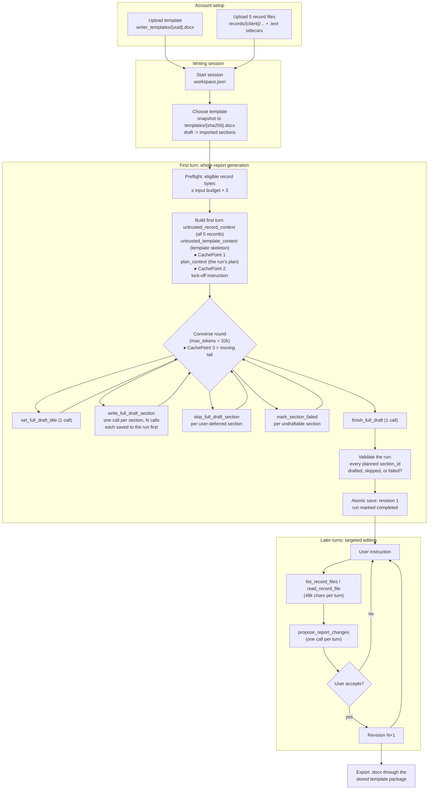

# Writer design

The Writing tab is an agentic report author built on Bedrock Converse tool
use. It has two modes that share one loop:

- **Targeted editing** — the interactive default. The model may read client
  records through tools and stages **typed proposals**
  (`propose_report_changes`) that the user reviews and accepts. Nothing the
  model does mutates the accepted report directly.
- **Whole-report generation** — the one-action "fill the whole report" path.
  Claria preloads every readable record into the first turn and the model
  writes every section through internal tool rounds. Each section is written
  through to a **drafting run** object before its success result is returned,
  so a generation that dies partway keeps everything that landed; a
  successful `finish_full_draft` assembles the run and saves **one atomic
  versioned revision** with no proposal gate.

  A live run owns its Writing session: hand edits, template applies,
  reverts, and further writer turns are refused until it finishes or fails.
  It fails open — a failed run releases the session immediately and its
  drafted sections stay readable for a resume. A run the user **stops** is
  the exception: it keeps the session, because it is the state the report is
  picked back up from.

Crates: `claria-report-pipeline` owns the turn loop, budgets, and prompt
composition; `claria-report-store` owns everything durable — workspaces and
their ETag protocol, revisions, drafting runs, attempt and usage receipts,
and the writer prompt and template libraries; `claria-bedrock` owns the exact Converse wire
shape, tool schemas, and stop-reason handling; `claria-docx` owns template
import and export; `claria-desktop` wires commands, preferences, and audit
events.

**`drafting-runs.md` is the companion to this document.** This file covers the
two writing modes and the loop they share; that one covers the durable
machinery under whole-report generation — the run object and its per-section
state machine, the plan pass and its gate, the cached conversation layout, the
review fan-out, the findings lifecycle, and the deterministic completion gate.
Read it for anything about how a whole-report draft survives being interrupted,
or about what "complete" means.

## Scenario: from empty account to a hydrated report

1. **Upload a template to the account.** Preferences → Document Writer → Writer Templates
   stores the redacted `.docx` byte-for-byte at
   `writer_templates/{uuid}.docx` with a metadata sidecar. Import validation
   runs at upload (macros/embeddings/encryption rejected), but nothing is
   stripped — the package is kept whole for export-time formatting.
2. **Upload five record files.** Each PDF/DOCX gets a `.text` sidecar of
   structured Markdown via the extraction model; printable UTF-8 originals
   are readable as-is. These sidecars are what the writer actually reads.
3. **Start a Writing session.** A fresh workspace
   (`report-authoring/{client}/workspace.json`) opens on the setup tab.
4. **Choose the template.** Applying it does two things: an immutable copy
   of the source package is stored at
   `report-authoring/{client}/templates/{sha256}.docx` (export formatting),
   and the imported structured content — headings **and** boilerplate body
   text — becomes the working draft. The template's paragraphs are now data
   the model will see, not instructions (see `templates.md`).
5. **Plan the draft.** A planning model reads the same record snapshot and
   template structure and returns one row per section — what it must assert
   and which records support it — through a forced `submit_section_plan`
   call. The host checks coverage itself and checks every filename against the
   records; the plan lands on the run unapproved, for the clinician to edit
   and start. Which model does this is a per-role setting, defaulting to the
   newest capable Sonnet the account has.
6. **Hydrate as the first turn.** Starting the approved plan snapshots every
   readable record into `<untrusted_record_context>`, injects the base
   revision's structure and per-section template bodies as
   `<untrusted_template_context>`, injects the run's section plan as
   `<plan_context>`, and runs the full-draft tool protocol until
   `finish_full_draft` lands revision 1. Sections the plan marks skip are
   already skipped on the run, so the writer is never asked about them.
7. From there the session continues as targeted editing: instructions,
   record reads on demand, reviewable proposals, and eventually a DOCX
   export rendered back through the stored template package.

**Saved writer prompts.** Preferences → Document Writer → Prompt Library keeps a small
account-wide library of reusable steering instructions
(`claria-prompts/writer-library/{uuid}.json`), one per phase of a
clinician's workflow — "fill the history sections", "draft the summary
backing my diagnosis of $DIAGNOSIS". A picker beside the guidance box and
the targeted composer prefills the instruction, which the user edits before
sending. A picked prompt is ordinary user input: it never touches the
system prompt, the trust rules, or the turn loop, and its ceiling is the
instruction ceiling so a saved prompt is always submittable.

## Stopping

The writer shares chat's stop machinery — one registry, one `stop_stream`
command, the same `select!` on the signal beside the next frame
(`design/chat-streaming.md`). What differs is what a stop keeps.

Chat keeps the half-answer it streamed. The writer throws a partially
streamed response away **whole**: the frames in flight may be assembling a
tool call whose input JSON is still arriving, and half a
`write_full_draft_section` is not a section. Discarding it costs nothing,
because a call that does not complete commits nothing — the conversation
only ever grows by whole messages.

What survives a stop is what was already durable:

- **A drafting run** parks as `Stopped`, with every section it had landed
  still in the run object and the workspace still pointing at it. No
  revision is cut. The user resumes it, finalizes what it wrote, or
  discards it. The stop is checked twice between rounds — after a tool
  batch is executed and again before the next call is issued — so a stop
  pressed while a section is being written to S3 keeps that section and
  does not open one more billed conversation. Past the cut the stop is a
  no-op on both paths: once the serial writer has called
  `finish_full_draft`, or once every parallel branch has handed back its
  verdict, the revision is cut and stands.
- **A targeted turn** keeps nothing, which is the whole of its state: it
  saves only at the end, so a stopped turn is a clean abort.

Once `finish_full_draft` has succeeded the run is past its cut, and a stop
becomes a no-op for the rest of the turn. All that remains is one closing
call and the revision it authorizes; honouring a stop there would throw
away a draft the writer had finished.

Either way the attempt records a `stopped` receipt, so the tokens a stopped
turn spent stay traceable.

## Why you see 10+ tool calls when starting a new file

Whole-report generation is deliberately **one tool call per section**, not
one call for the document:

- `set_full_draft_title` — always exactly one call.
- `write_full_draft_section` — one call for **every** section the draft
  actually writes, plus one call per genuinely new section.
- `skip_full_draft_section` — one call per section the plan marks skip or
  the user's guidance defers to a later pass (e.g. "leave the summary until
  I supply a diagnosis"). A skipped section re-enters the saved revision as
  an **empty placeholder**: its heading and template position survive, its
  boilerplate body does not, and DOCX export omits it entirely until content
  is written into it. Writing into a deferred section — a later full-draft
  write, an accepted `replace_section` proposal, or a hand edit — un-defers
  it.
- `mark_section_failed` — one call per section the records genuinely cannot
  support, after an attempt. A failed section keeps its base-revision
  content unchanged and the run completes with the failure recorded on it,
  rather than the whole document stalling on one gap. The host marks a
  section failed the same way after three rejected writes for it, so a
  section the writer cannot land does not spend the run's call budget.
- `finish_full_draft` — one call. The finalizer refuses unless **every**
  planned section has been written, **explicitly skipped**, or **marked
  failed** — an undecided section is an error, so stale template facts
  cannot survive and nothing disappears silently. A ten-section evaluation
  template is ten decisions minimum.

So a typical templated report is N+2 calls at minimum, spread across several
Converse rounds: each response is capped at the 32k output reserve, and a
response cut off mid-call is salvaged (completed calls execute, the model
continues in the next round). The activity feed shows every call, which is
why a fresh ten-section report reads as 12+ tool calls even when nothing is
wrong.

Each round is a `ConverseStream` call, reassembled into a whole message
before the loop acts on it. Nothing reaches the UI incrementally — a tool
call is only executable once complete — but at a 32k output reserve a unary
request would sit idle long enough to risk an HTTP timeout while the model
generates, so the connection carries frames throughout instead.

A round whose request never completes — the stream never starts, goes
silent past the idle bound, or drops mid-response, or the request never
gets a response at all — is **retried up to twice** with the identical
request. Nothing from a
failed attempt is committed, so the re-send is safe, and a quick retry
re-reads the prompt cache the previous completed round wrote. When all
three attempts go unanswered, the turn fails with the attempt count and how
long Bedrock went without responding; usage from completed calls is
retained. Refused requests (throttled, denied, invalid) are answered, not
interrupted, and still fail the turn immediately.

Targeted turns can also legitimately reach double digits: a turn that
consults the records costs `list_record_files` (1) plus one
`read_record_file` per file — and large sidecars paginate at 8,000
characters per read (12,000 max) against a 48,000-character per-turn read
budget — before the single `propose_report_changes` call.

Section-per-call is a correctness choice, not an inefficiency: each section
arrives as validated structured JSON (schema-checked by Bedrock before
Claria sees it), a truncated response loses at most the in-flight section,
and per-call usage records give per-section cost and latency telemetry.

## Context window: yes, there is a ceiling

Claria treats Opus 4.6 as a **200,000-token** context window (capability
table; explicit `:1m` profile variants would widen it). Every writer call
reserves 32,768 output tokens, leaving an input budget of ~167k tokens,
pre-flighted with one real `CountTokens` per turn and incremental estimates
after that (~4 chars/token, re-verified near the budget).

**Turn count is not the limit — document size is.** A user can keep writing
indefinitely as far as history is concerned, because every contributor to
the prompt is independently bounded:

| Contributor | Bound |
|---|---|
| Conversation history (protocol) | 512 KiB hard ceiling (~128k tokens); oldest turns pruned first. Retained turns configurable, default 200 |
| Old record reads in history | Sanitized to `{"content_retained": false}` stubs after the 5-minute exact-protocol cache expires — record text is never re-sent across turns |
| Record reads within a turn | 48,000 characters per turn |
| Whole-report record snapshot | Preflight: eligible source bytes ≤ input budget × 3 (~490 KiB on Opus 4.6); oversized sets fail with a remove-or-split error before any model call |
| The report itself | Domain cap of 500,000 characters of content |

The one contributor that grows with the user's work is the report: in
targeted editing the **entire accepted report rides into every turn** inside
`<untrusted_report_context>` (pretty-printed JSON), because the user may
have hand-edited between turns and the model must copy real section ids.
Whole-report drafting sends the base revision's structure and template
bodies instead — the mutable draft it is about to replace never enters the
cached prefix.
A report near the 500k-character domain cap is ~125k+ tokens before history
and instructions, so a sufficiently huge document can make a turn exceed the
input budget. When that happens the turn **fails up front with an explicit
context-overflow error** — never a silently truncated prompt — and the
remedy is splitting the report. In clinical practice a report has to be
enormous (on the order of a hundred thousand words of content) before this
bites; rising per-turn input cost shows up in the usage tab long before the
hard error does.

Note the coupling: raising the output reserve (8k → 32k in the quality-
regression fix) shrank both the input budget and the whole-report snapshot
ceiling (~575 KiB → ~490 KiB). Reserve, input budget, and snapshot preflight
are all derived from each other by design — see the Bedrock rules in
CLAUDE.md.

## What travels on each turn

Inbound: composed system prompt (editable body + fixed trust rules), the
protocol history (exact cached copy within 5 minutes, sanitized persisted
history after), and a fresh user message carrying the full report context
plus the instruction. Outbound: **typed section-level operations only** —
the model never emits the document. Within a turn's tool loop each Converse
call resends the growing protocol, but a cache point on the conversation
tail means repeated prefix tokens bill at cache-read rates; the `turn
complete` console line reports the hit rate, stop reason, latency, and the
ceiling in effect.
